# ThePhish

<div>
  <p align="center">
     
  </p>
</div>

ThePhish is an automated phishing email analysis tool based on [TheHive](https://github.com/TheHive-Project/TheHive), [Cortex](https://github.com/TheHive-Project/Cortex/) and [MISP](https://github.com/MISP/MISP). It is a web application written in Python 3 and based on Flask that automates the entire analysis process starting from the extraction of the observables from the header and the body of an email to the elaboration of a verdict which is final in most cases. In addition, it allows the analyst to intervene in the analysis process and obtain further details on the email being analyzed if necessary. In order to interact with TheHive and Cortex, it uses [TheHive4py](https://github.com/TheHive-Project/TheHive4py) and [Cortex4py](https://github.com/TheHive-Project/Cortex4py), which are the Python API clients that allow using the REST APIs made available by TheHive and Cortex respectively.


[](https://www.python.org/)
[](https://github.com/emalderson/ThePhish/tree/master/docker)
[](https://github.com/emalderson/ThePhish)
[](https://github.com/emalderson/ThePhish/blob/master/LICENSE)
[](https://github.com/emalderson/ThePhish)

## Table of contents

* [Overview](#overview)
* [ThePhish example usage](#thephish-example-usage)
  + [A user sends an email to ThePhish](#a-user-sends-an-email-to-thephish)
  + [The analyst analyzes the email](#the-analyst-analyzes-the-email)
* [Implementation](#implementation)
* [Installation](#installation)
  + [Install it using Docker and Docker Compose](#install-it-using-docker-and-docker-compose)
  + [Install it from scratch](#install-it-from-scratch)
* [Configure the analyzers](#configure-the-analyzers)
  + [Configure the levels of the analyzers](#configure-the-levels-of-the-analyzers)
  + [Tested analyzers](#tested-analyzers)
  + [Enable the *MISP* analyzer](#enable-the-misp-analyzer)
  + [Enable the *Yara* analyzer](#enable-the-yara-analyzer)
* [Enable the *Mailer* responder](#enable-the-mailer-responder)
* [Use the whitelist](#use-the-whitelist)
* [Contribution to TheHive4py](#contribution-to-thehive4py)
* [License](#license)
* [Academic publications](#academic-publications)
* [GitHub repositories mentioning ThePhish](#github-repositories-mentioning-thephish)
* [Who talks about ThePhish](#who-talks-about-thephish)
* [Credits](#credits)


## Overview

The following diagram shows how ThePhish works at high-level:

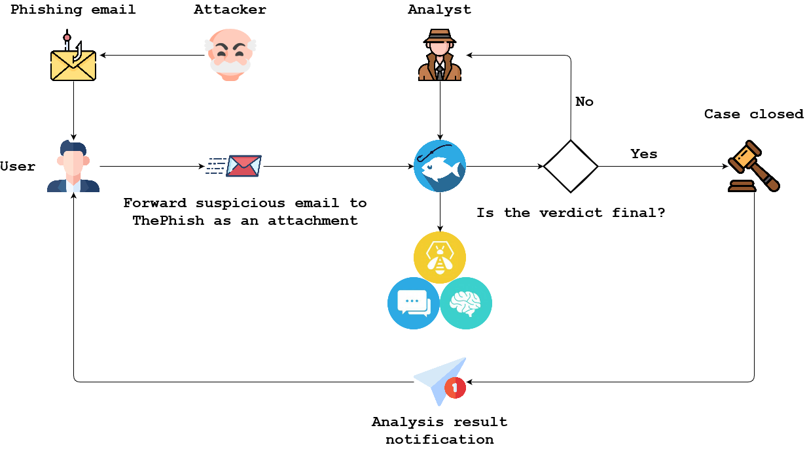

 1. An attacker starts a phishing campaign and sends a phishing email to a user.
 2. A user who receives such an email can send that email as an attachment to the mailbox used by ThePhish.
 3. The analyst interacts with ThePhish and selects the email to analyze.
 4. ThePhish extracts all the observables from the email and creates a case on TheHive. The observables are analyzed thanks to Cortex and its analyzers.
 5. ThePhish calculates a verdict based on the verdicts of the analyzers.
 6. If the verdict is final, the case is closed and the user is notified. In addition, if it is a malicious email, the case is exported to MISP.
 7. If the verdict is not final, the analyst's intervention is required. He must review the case on TheHive along with the results given by the various analyzers to formulate a verdict, then he can send the notification to the user, optionally export the case to MISP and close the case.


## ThePhish example usage

This example aims to demonstrate how a user can send an email to ThePhish for it to be analyzed and how an analyst can actually analyze that email using ThePhish.

### A user sends an email to ThePhish

A user can send an email to the email address used by ThePhish to fetch the emails to analyze. The email has to be forwarded as an attachment in EML format so as to prevent the contamination of the email header. In this case, the used mail client is Mozilla Thunderbird and the used email address is a Gmail address.

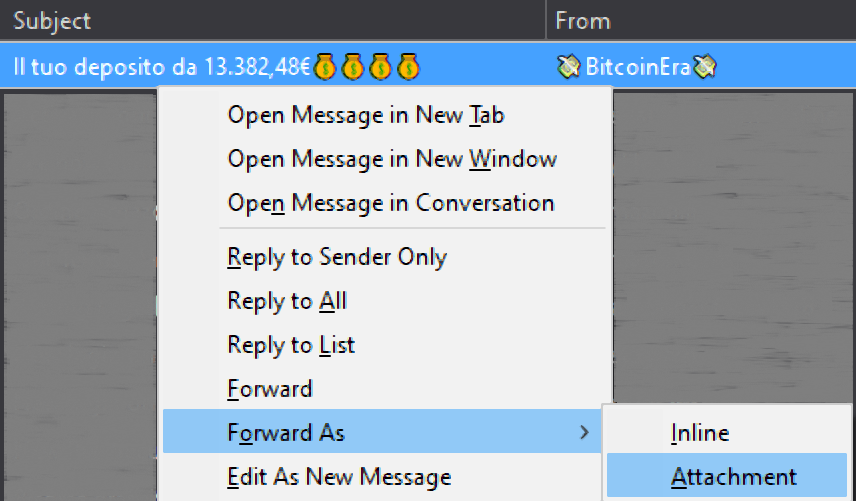

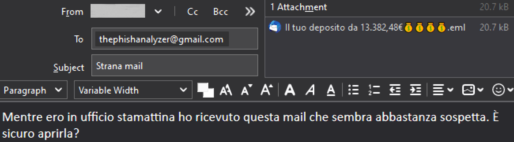

### The analyst analyzes the email

The analyst navigates to the web page of ThePhish and clicks on the "List emails" button to obtain the list of emails to analyze.

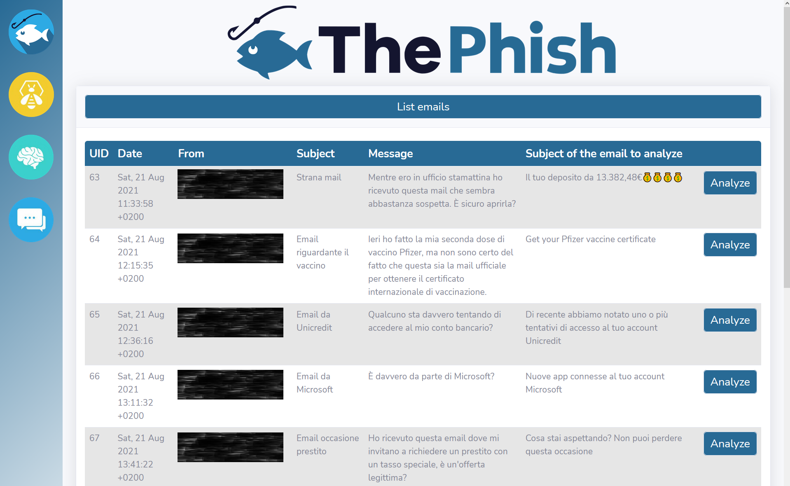

When the analyst clicks on the "Analyze" button related to the selected email, the analysis is started and its progress is shown on the web interface.

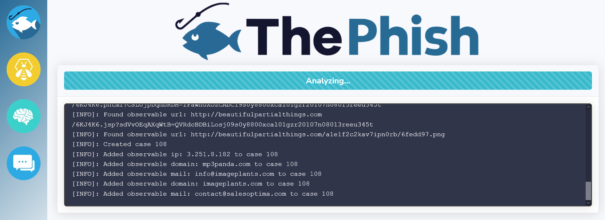

In the meantime, ThePhish extracts the observables (URLs, domains, IP addresses, email addresses, attachments and hashes of those attachments) from the email and then interacts with TheHive to create the case.


Three tasks are created inside the case.

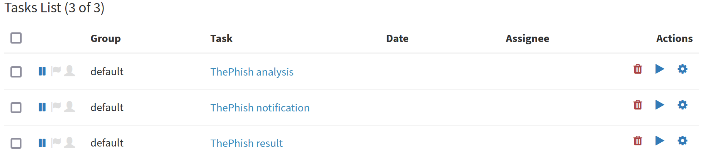

Then, ThePhish starts adding the extracted observables to the case.

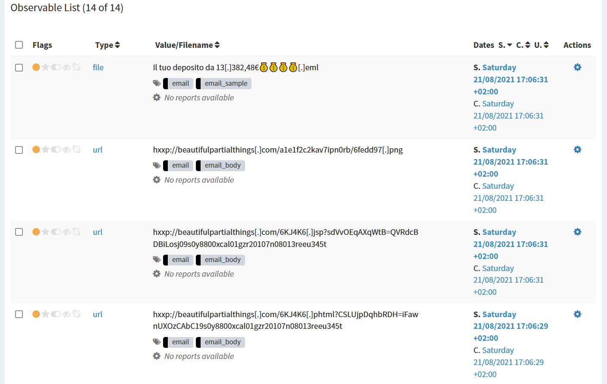

At this point the user is notified via email that the analysis has started thanks to the *Mailer* responder.

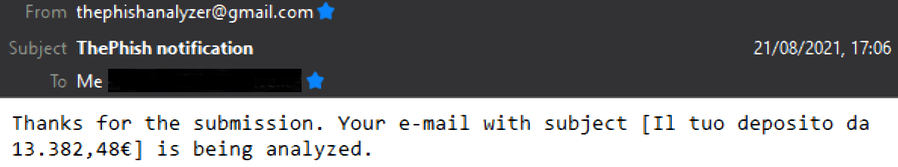

The description of the first task allows the *Mailer* responder to send the notification via email.

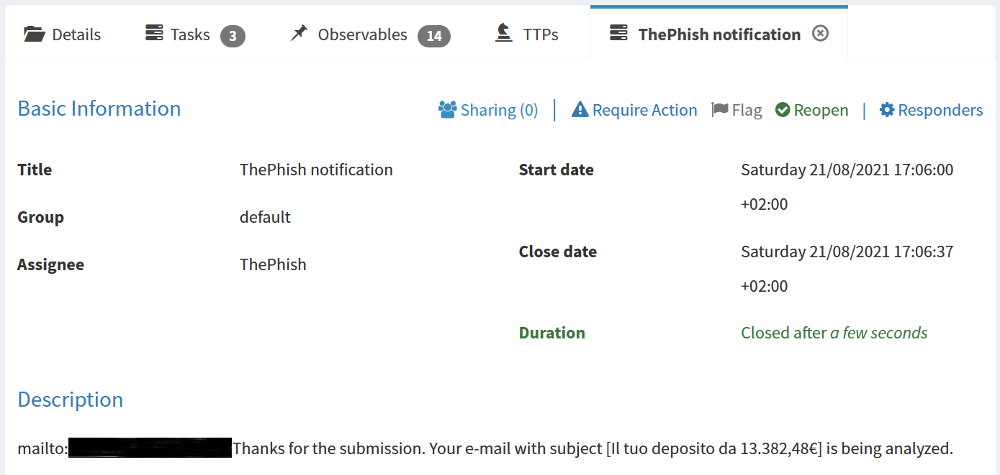

After the first task is closed, the second task is started and the analyzers are started on the observables. The analysis progress is shown on the web interface while the analyzers are started.

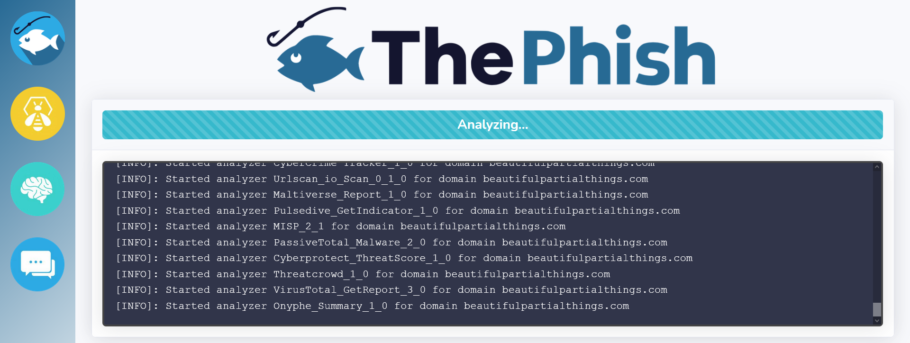

The analysis progress can also be viewed on TheHive, thanks to its live stream.

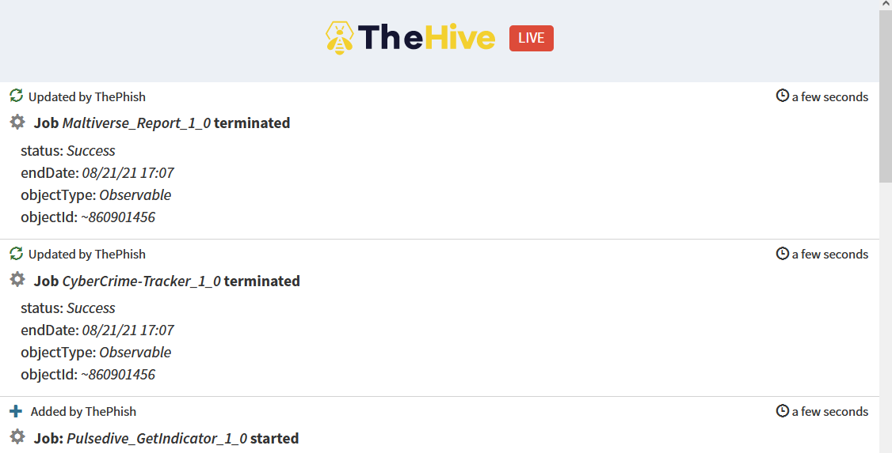

Once all the analyzers have terminated their execution, the second task is closed and the third one is started, then ThePhish calculates the verdict. Since the verdict is "malicious", all the observables that are found to be malicious are marked as IoC. In this case only one observable is marked as IoC.

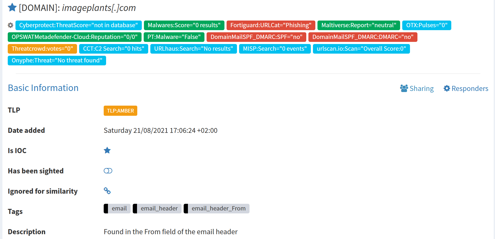

The case is then exported to MISP as an event, with a single attribute represented by the observable mentioned above. 

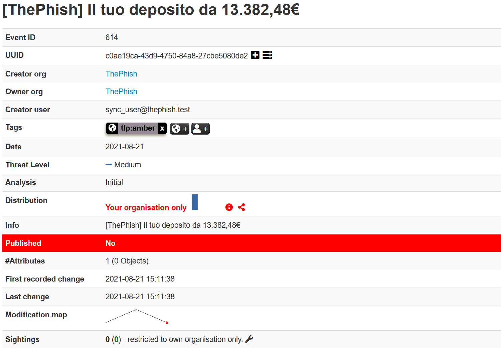

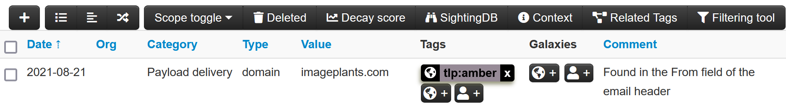

Then, ThePhish sends the verdict via email to the user thanks to the *Mailer* responder.

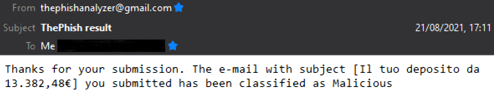

Finally, both the task and the case are closed. The description of the third task allows the *Mailer* responder to send the verdict via email. Moreover, the case has been closed after five minutes and resolved as "True Positive" with "No Impact", which means that the attack has been detected before it could do any damage.

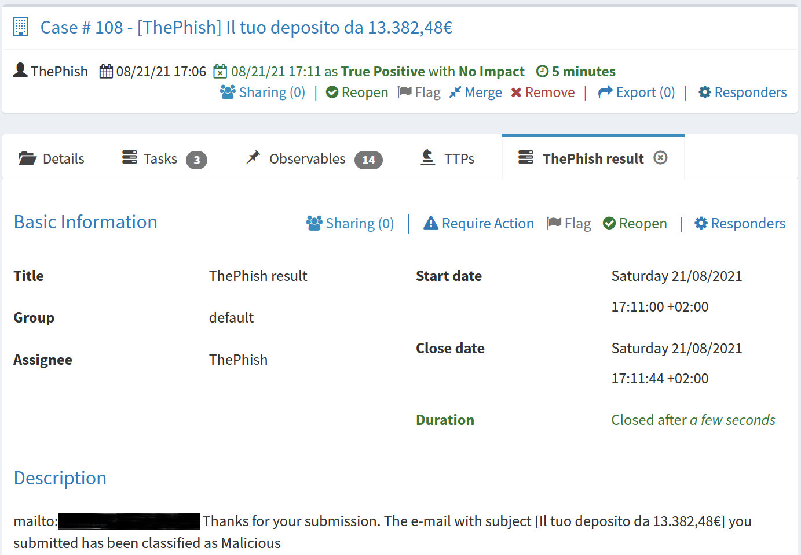

Once the case is closed, the verdict is available for the analyst on the web interface together with the entire log of the analysis progress.

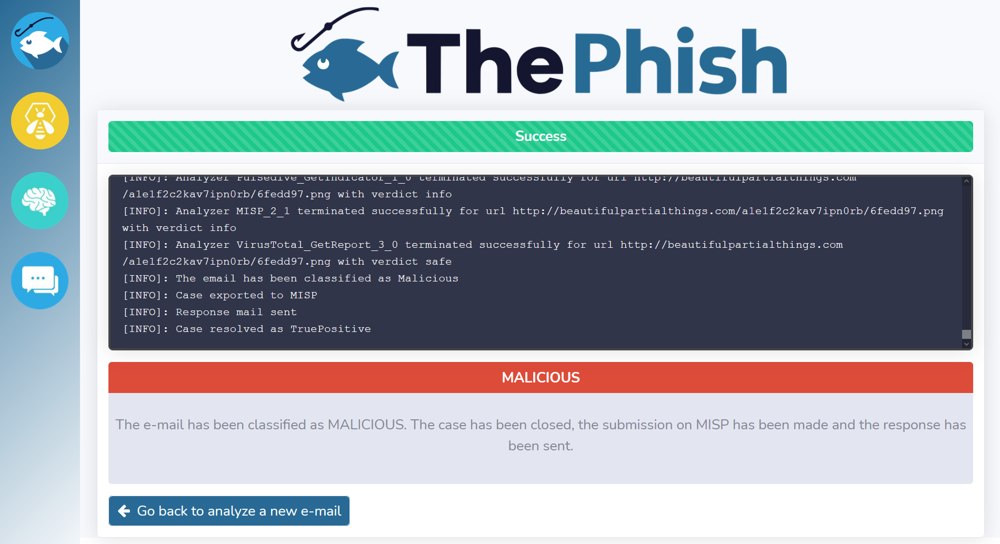

At this point the analyst can go back and analyze another email. The above-depicted case was related to a phishing email, but a similar workflow can be observed when the analyzed email is classified as "safe". Indeed, the case is closed and the verdict is sent via email to the user.

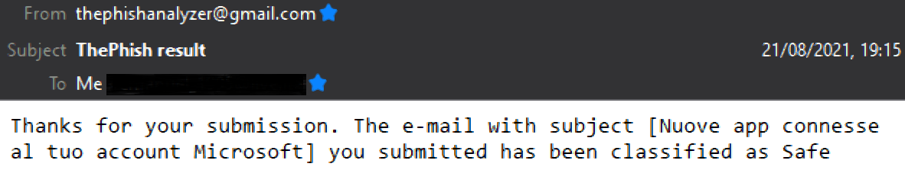

Then, the verdict is also displayed to the analyst on the web interface.

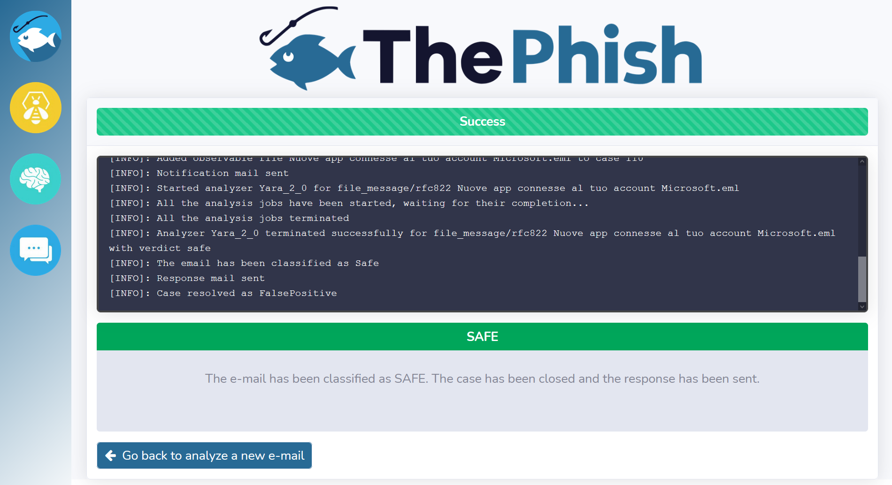

On the other hand, when an email is classified as "suspicious", the verdict is only displayed to the analyst on the web interface.

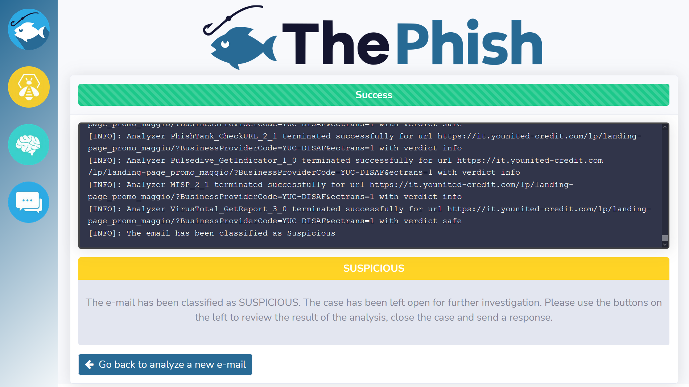
	
At this point the analyst needs to use the buttons on the left-hand side of the page to use TheHive, Cortex and MISP for further analysis. This is because the analysis has not been completed yet and so the user is only notified that the analysis of the email that he forwarded to ThePhish has been started. Indeed, the last task and the case have not been closed yet since they need to be closed by the analyst himself once he elaborates a final verdict. 

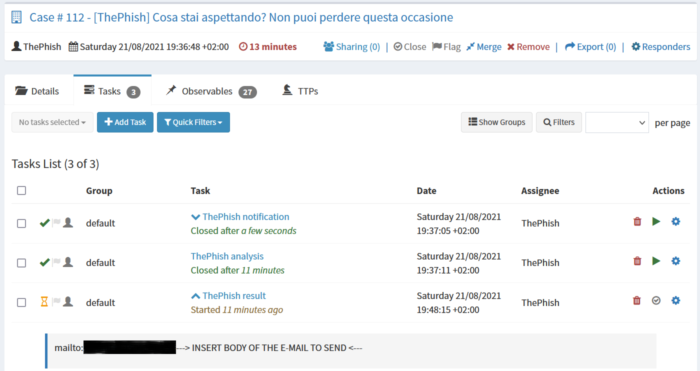

The analyst can view the reports of all the analyzers on TheHive and Cortex and, in case this revealed not to be enough, he could also download the EML file of the email and analyze it manually.

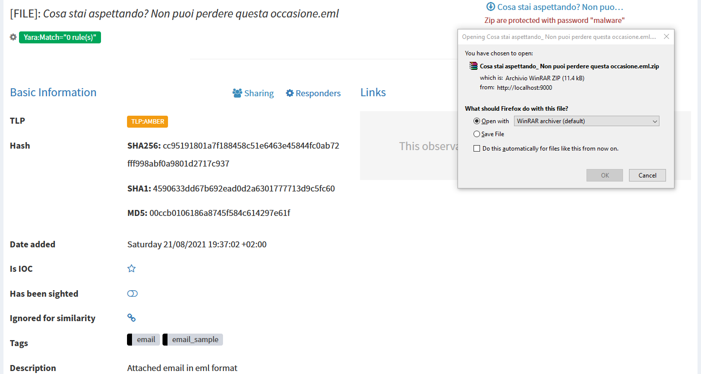

When the analyst terminates the analysis, he can populate the body of the email to send to the user in the description of the last task, start the *Mailer* responder, export the case to MISP if the verdict is "malicious" by clicking on the "Export" button and then close the case.

## Implementation

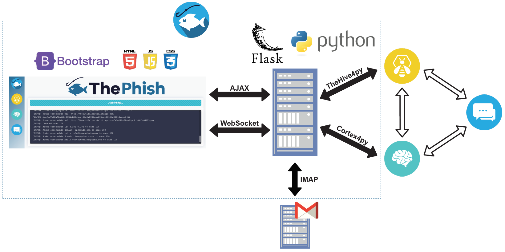

ThePhish is a web application written in Python 3. The web server is implemented using Flask, while the front-end part of the application, which is the dynamic page written in HTML, CSS and JavaScript, is implemented using Bootstrap. Apart from the web server module, the back-end logic of the application is constituted by three Python modules that encapsulate the logic of the application itself and a Python class used to support the logging facility through the WebSocket protocol. If you want to see a graphical representation of the application logic, click [here](diagrams.md). Moreover, there are several configuration files used by the aforementioned modules that serve various purposes.

When the analyst navigates to the base URL of the application, the web page of ThePhish is loaded and a bi-directional connection is established with the server. This is done by using the *Socket.IO* JavaScript library in the web page that enables real-time, bi-directional and event-based communication between the browser and the server. This connection is established with a WebSocket connection whenever possible and will use HTTP long polling as a fallback. For this to work, the server application uses the *Flask-SocketIO* Python library, which provides a Socket.IO integration for Flask applications. This connection is then used by ThePhish to display the progress of the analysis on the web interface.  

Every time the analyst performs an action on the web interface, an AJAX request is sent to the server, which is an asynchronous HTTP request that permits to exchange data with the server in the background and update the page without reloading it. This allows the analyst both to visualize the list of emails to analyze and to make the analysis start.

ThePhish interacts with TheHive and Cortex thanks to TheHive4py and Cortex4py. Moreover, it interacts with an IMAP server to retrieve the emails to analyze.


## Installation

### Install it using Docker and Docker Compose

Since the installation and configuration of TheHive, Cortex and MISP services from scratch for a production environment may not be extremely straightforward, TheHive Project provides Docker images and Docker Compose templates [here](https://github.com/TheHive-Project/Docker-Templates) to facilitate the installation procedure. For the sake of simplicity, the provided templates are made simple, without providing the full configuration options of each docker image.

If you only want to try ThePhish or you want to have it up and running as fast as possible, you can use the provided Docker Template in the `docker` folder, which is a modified version of one of the Docker Templates provided by TheHive Project that also allows creating a ThePhish container. To install ThePhish using Docker and Docker Compose, please refer to [this guide](https://github.com/emalderson/ThePhish/tree/master/docker). I strongly recommend that you install it this way at least the first time you use it so that you can learn the basics and how to configure it with a minimal configuration that should work on the first try. Indeed, the previously linked guide also provides a step-by-step procedure to configure the TheHive, Cortex and MISP instances.

### Install it from scratch

This guide refers to the sole installation of ThePhish, which requires:
 - An up-and-running instance of TheHive
 - An up-and-running instance of Cortex
 - An up-and-running instance of MISP
 - An email address that users can use to send emails to ThePhish
 - A Linux-based OS with Python 3.8+ installed

In order to install, configure and integrate TheHive, Cortex and MISP instances, please refer to their official documentation: 
 - [TheHive documentation](https://docs.thehive-project.org/thehive/)
 - [Cortex documentation](https://github.com/TheHive-Project/CortexDocs)
 - [MISP documentation](https://www.misp-project.org/documentation/)

It is advisable that the email address from which ThePhish fetches the emails to analyze be a Gmail address since it is the one with which ThePhish has been tested the most. It is preferable that the account is a newly created one, with the sole purpose of being used by ThePhish. The procedure to activate the app password that is required by ThePhish to connect to the mailbox and fetch the emails is explained [here](https://support.google.com/accounts/answer/185833?hl=en).

This installation procedure has been tested on a VM running Ubuntu 20.04.3 LTS with Python 3.8 installed and the versions of TheHive, Cortex and MISP shown in this [docker-compose.yml](https://github.com/emalderson/ThePhish/blob/master/docker/docker-compose.yml) file.

Once TheHive, Cortex and MISP are configured and listening at a certain URL and the email address is ready to use, you can install and configure ThePhish. 

 1. Clone the repository
	```    
	$ git clone https://github.com/emalderson/ThePhish.git
	```
 2. Create a Python virtual environment and activate it (it is good practice but it is not required)
	```     
	$ cd ThePhish/app
	$ sudo apt install python3-venv
	$ python3 -m venv venv
	$ source venv/bin/activate
	 ```
 3. Install the requirements
	```
	$ pip install -r requirements.txt
	```
 4. Add the `run_responder()` function to the file `api.py` of TheHive4py
	 
	 In order to send emails to the user, ThePhish uses the *Mailer* responder. Since ThePhish uses TheHive4py to interact with TheHive, a function that allows running a responder by its ID is needed. Unfortunately, this function is not part of TheHive4py yet, but a pull request has been made to add it to TheHive4py ([#219](https://github.com/TheHive-Project/TheHive4py/pull/219)). While waiting for it to be added, it must be manually added using the following command for ThePhish to work properly (replace the version of Python in the command if you use a different version of Python):
	```bash
	$ (cat << _EOF_


	    def run_responder(self, responder_id, object_type, object_id):
	        req = self.url + "/api/connector/cortex/action"
	        try:
	            data = json.dumps({ "responderId": responder_id, "objectType": object_type, "objectId": object_id})
	            return requests.post(req, headers={"Content-Type": "application/json"}, data=data, proxies=self.proxies, auth=self.auth, verify=self.cert)
	        except requests.exceptions.RequestException as e:
	            raise TheHiveException("Responder run error: {}".format(e))
	_EOF_
	) | tee -a venv/lib/python3.8/site-packages/thehive4py/api.py > /dev/null
	```
 5. Configuration
	 
	 The file `configuration.json` is the global configuration file that allows setting the parameters for the connection to the mailbox and to the instances of TheHive, Cortex and MISP. It also allows setting parameters related to the cases that will be created on TheHive.
	```json
	{
		"imap" : {
			"host" : "imap.gmail.com",
			"port" : "993",
			"user" : "",
			"password" : "",
			"folder" : "inbox"
		},
		"thehive" : {
			"url" : "http://thehive:9000",
			"apikey" : ""
		},
		"cortex" : {
			"url" : "http://cortex:9001",
			"apikey" : "",
			"id" : "local"
		},
		"misp" : {
			"id" : "MISP THP"
		},
		"case" : {
			"tlp" : "2",
			"pap" : "2",
			"tags" : ["email", "ThePhish"]
		}
	}
	```
	- In the *imap* part, if you are using a Gmail address, you only need to set the username used to connect to the IMAP server (which is your email address) and the app password.
	 - In the *thehive* part you have to set the URL at which the TheHive instance is reachable and set the API key of the user created on TheHive that ThePhish will use to interact with TheHive.
	 - In the *cortex* part you have to set the URL at which the Cortex instance is reachable and set the API key of the user created on Cortex that both ThePhish and TheHive will use to interact with Cortex. Moreover, you have to set the ID given to the Cortex instance.
	 - In the *misp* part you only have to set the ID given to the MISP instance.
	 - In the *case* part you can set the default TLP and PAP levels for the cases created by ThePhish and also the tags that will be applied to them at their creation.
	 
	 You can learn how to create an organization and a user with `org-admin` role in that organization on TheHive and obtain its API key [here (ThePhish documentation, recommended)](https://github.com/emalderson/ThePhish/tree/master/docker#configure-the-thehive-container) or [here (TheHive documentation)](https://docs.thehive-project.org/thehive/legacy/thehive3/admin/admin-guide/). Similarly, you can learn how to create an organization and a user with `read, analyze` roles in that organization on Cortex and obtain its API key [here (ThePhish documentation, recommended)](https://github.com/emalderson/ThePhish/tree/master/docker#configure-the-cortex-container) or [here (Cortex documentation)](https://github.com/TheHive-Project/CortexDocs/blob/master/admin/admin-guide.md#users).
	 
	 The URLs and the IDs that are set in this file must be the same that are set in the configuration file of TheHive named `application.conf`, which contains a part related to Cortex and a part related to MISP. The parameters that you should look for are `name` and `url` in both parts, which correspond to the IDs and the URLs of the Cortex and MISP instances. The IDs can also be found in the *About* window on the web interface of TheHive. An example where the Cortex ID is the string `local` and the MISP ID is the string `MISP THP` is shown in the following figure:

	 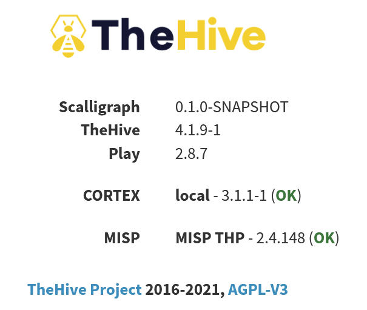

	 The file `application.conf` is used to integrate TheHive with Cortex and MISP. You can learn how to set up the integration with Cortex [here (ThePhish documentation, recommended)](https://github.com/emalderson/ThePhish/blob/master/docker/README.md#integrate-thehive-with-cortex) or [here (TheHive documentation)](https://docs.thehive-project.org/thehive/installation-and-configuration/configuration/connectors-cortex/), while for the integration with MISP you can go [here (ThePhish documentation, recommended)](https://github.com/emalderson/ThePhish/blob/master/docker/README.md#integrate-thehive-with-misp) or [here (TheHive documentation)](https://docs.thehive-project.org/thehive/installation-and-configuration/configuration/connectors-misp/).

	 The URLs at which TheHive, Cortex and MISP instances are reachable should also be replaced in the file `templates/index.html` so that the buttons on the web interface will be able to reach them. To do that, replace the last three `href` of this portion of code:
	```html
	<ul class="navbar-nav text-light" id="accordionSidebar">
	    <li class="nav-item"><a class="nav-link active" href="/" style="max-width: 114px;" target="_blank" rel="noopener noreferrer"></a></li>
	    <li class="nav-item"><a class="nav-link" href="http://thehive:9000" style="max-width: 114px;" target="_blank" rel="noopener noreferrer"></a></li>
	    <li class="nav-item"><a class="nav-link" href="http://cortex:9001" style="max-width: 114px;" target="_blank" rel="noopener noreferrer"></a></li>
	    <li class="nav-item"><a class="nav-link" href="https://misp" style="max-width: 114px;" target="_blank" rel="noopener noreferrer"></a></li>
    </ul>
	```

 6. Start the app
	```
	$ python3 thephish_app.py
	```
 	The server that will be used to run the application is the WSGI server provided by eventlet, since it is listed in the requirements. It is needed for the WebSocket protocol to work and avoid falling back to HTTP long polling. Without eventlet, the default Flask WSGI server (Werkzeug) will be used.
	If you wish to use another WSGI server (e.g. Gunicorn) or use a reverse proxy (e.g. NGINX), the [Flask-SocketIO documentation](https://flask-socketio.readthedocs.io/en/latest/deployment.html) explains how to do that.
	
	Now the application should be reachable at `http://localhost:8080`.
	
	**:warning: Warning**: If you are using Mozilla Firefox to use ThePhish and for some reason an error message appears during the analysis, the solution may be found [here](https://github.com/emalderson/ThePhish/tree/master/docker#use-thephish).

## Configure the analyzers

ThePhish can start an analyzer or a responder only if it is enabled and correctly configured on Cortex. [This](https://github.com/TheHive-Project/CortexDocs/blob/master/admin/admin-guide.md#organizations-users-and-analyzers) part of the documentation explains how to enable them, while [this](https://github.com/TheHive-Project/CortexDocs/blob/master/analyzer_requirements.md) part lists the available analyzers and responders with their configuration parameters. It should be noted that while many analyzers are free to use, some require special access and others necessitate a valid service subscription or product license.

### Configure the levels of the analyzers

Each analyzer outputs a report in JSON format that contains a maliciousness level for an observable that can be one of "info", "safe", "suspicious" or "malicious". However, even though the report structure usually follows a convention, this convention is not always respected. Moreover, after the analysis of the code of many analyzers and several tests, some analyzers have been found to contain bugs. For this reason, some tweaks and workarounds have been used either to obtain the maliciousness levels provided by these analyzers anyway or to prevent the application from crashing due to those bugs.

Furthermore, these levels do not always represent the real maliciousness level of an observable. Since this depends on how the analyzers themselves have been programmed, ThePhish comes with another configuration file called `analyzers_level_conf.json`, with which it is possible to create a mapping between the actual maliciousness levels provided by any analyzer and the levels decided by the analyst. Besides that, this file allows the analyst to choose what are the observable types to which these modifications should be applied. The file needs to follow the structure shown in the example here, using the exact name of the analyzers to configure and with the desired level on the right. If an analyzer is not listed in this file, then the maliciousness levels it provides are left untouched. The file needs to follow the structure shown in the following example, using the exact name of the analyzers to configure and with the desired level on the right. If an analyzer is not listed in this file, then the maliciousness levels it provides are left untouched.

```json
{
	"DomainMailSPFDMARC_Analyzer_1_1" : {
		"dataType" : ["url", "ip", "domain", "mail"],
		"levelMapping" : {
			"malicious" : "suspicious",
			"suspicious" : "suspicious",
			"safe" : "safe",
			"info" : "info"
		}
	},
	"MISP_2_1" : {
		"dataType" : ["url", "ip", "domain", "mail"],
		"levelMapping" : {
			"malicious" : "malicious",
			"suspicious" : "malicious",
			"safe" : "safe",
			"info" : "info"
		}
	},
	"VirusTotal_GetReport_3_0" : {
		"dataType" : ["ip", "domain"],
		"levelMapping" : {
			"malicious" : "info",
			"suspicious" : "info",
			"safe" : "safe",
			"info" : "info"
		}
	}
}
```

In this example, the level "suspicious" for the *MISP_2_1* analyzer is raised to "malicious" since it indicates that some observables in the email being currently analyzed have already been sighted in a previously analyzed email for which the verdict was "malicious". Conversely, the level "malicious" of the *DomainMailSPFDMARC_Analyzer_1_1* analyzer is lowered to "suspicious", since many legitimate domains do not have DMARC and SPF records configured. Moreover, the levels "suspicious" and "malicious" given by the *VirusTotal_GetReport_3_0* analyzer for IP addresses and domains are lowered to "info" since they have been observed to lead to lots of false positives. 

You can add or remove analyzers in this file at your will, but I recommend that you leave the ones that are already present in the file untouched since those modifications have been motivated by many tests performed on a lot of different emails.

### Tested analyzers
ThePhish has been tested with the following analyzers:
- AbuseIPDB_1_0
- AnyRun_Sandbox_Analysis_1_0
- CyberCrime-Tracker_1_0
- Cyberprotect_ThreatScore_3_0
- *DomainMailSPFDMARC_Analyzer_1_1*
- DShield_lookup_1_0
- EmailRep_1_0
- FileInfo_8_0
- Fortiguard_URLCategory_2_1
- IPinfo_Details_1_0
- **IPVoid_1_0** 
- Maltiverse_Report_1_0
- *Malwares_GetReport_1_0* 
- *Malwares_Scan_1_0*
- MaxMind_GeoIP_4_0 
- MetaDefenderCloud_GetReport_1_0
- *MISP_2_1*
- *Onyphe_Summary_1_0*
- OTXQuery_2_0
- PassiveTotal_Enrichment_2_0 
- *PassiveTotal_Malware_2_0* 
- PassiveTotal_Osint_2_0 
- PassiveTotal_Ssl_Certificate_Details_2_0 
- PassiveTotal_Ssl_Certificate_History_2_0 
- PassiveTotal_Unique_Resolutions_2_0 
- PassiveTotal_Whois_Details_2_0 
- PhishTank_CheckURL_2_1
- **Pulsedive_GetIndicator_1_0**
- *Robtex_Forward_PDNS_Query_1_0*
- *Robtex_IP_Query_1_0* 
- *Robtex_Reverse_PDNS_Query_1_0*
- Shodan_DNSResolve_1_0 
- **Shodan_Host_1_0** 
- **Shodan_Host_History_1_0**
- Shodan_InfoDomain_1_0 
- **SpamhausDBL_1_0**
- StopForumSpam_1_0
- *Threatcrowd_1_0*	
- UnshortenLink_1_2
- **URLhaus_2_0** 
- Urlscan_io_Scan_0_1_0 
- *Urlscan_io_Search_0_1_1* 
- *VirusTotal_GetReport_3_0*
- VirusTotal_Scan_3_0 
- Yara_2_0

The analyzers emphasized in *italic* are the ones for which the levels have been modified (but that can be overridden, even though it is not advisable), while the analyzers emphasized in **bold** are the ones that are handled directly in the code of ThePhish either because they do not respect the convention for the report structure, or because they have bugs. Moreover, the following analyzers are handled in the code of ThePhish to use them in the best possible manner:

- **DomainMailSPFDMARC_Analyzer_1_1**: It is started only on domains that are supposed to be able to send emails.
	
- **MISP_2_1**: It is used for the integration with MISP.
   
- **UnshortenLink_1_2**: It is started before any other analyzer on a URL so as to make it possible to unshorten a link and add the unshortened link as an additional observable.
  
- **Yara_2_0**: It is the only one that is started on the EML attachment.


### Enable the *MISP* analyzer

In order to integrate Cortex with MISP, you must activate the *MISP_2_1* analyzer and configure it with the authentication key of the user created on MISP that Cortex will use to interact with MISP. This means that an organization and a user with `sync_user` role in that organization must be created on MISP beforehand (you can learn how to do that and obtain the authentication key [here (ThePhish documentation, recommended)](https://github.com/emalderson/ThePhish/tree/master/docker#configure-the-misp-container) or [here (MISP documentation)](https://www.circl.lu/doc/misp/administration/#users).

### Enable the *Yara* analyzer

If you want to use the *Yara_2_0* analyzer, you must create a folder on the machine on which Cortex is running that contains:

 - The Yara rules, where each rule is a file with the `.yar` extension
 - A file named `index.yar`, which contains a line for each Yara rule in that folder that respects this syntax: `include "yara_rule_name.yar"`

Then, you must configure the path of this folder on Cortex. For example, if you created the folder `yara_rules` in the path `/opt/cortex`, then you need to configure the path `/opt/cortex/yara_rules` on Cortex (on the web interface).

## Enable the *Mailer* responder

In order to send the emails to the users, the *Mailer* responder must be enabled and correctly configured. The procedure used to enable a responder is identical to the procedure used to enable an analyzer. If you are using a Gmail address, these are the correct parameters to set:
- from: `<YourGmailEmailAddress>`
- smtp_host :`smtp.gmail.com`
- smtp_port: `587`
- smtp_user: `<YourGmailEmailAddress>`
- smtp_pwd: `<YourGmailEmailAddressAppPassword>`


## Use the whitelist

ThePhish allows creating a whitelist in order to avoid analyzing observables that may cause false positives or that the analyst decides that they should not be considered during the analysis. The whitelist is contained in a file named `whitelist.json` and is constituted by many different lists so as to offer great flexibility both in terms of observable types to match and matching modes. It supports the following matching modes:

 - Exact string matching for email addresses, IP addresses, URLs, domains, file names, file types and hashes
 - Regex matching for email addresses, IP addresses, URLs, domains and file names
 - Regex matching for subdomains, email addresses and URLs that contain the specified domains


Here is shown a toy example of the `whitelist.json` file.

```json
{	
	"exactMatching": {
		"mail" : [],
		"ip" : [
			"127.0.0.1",
			"8.8.8.8",
			"8.8.4.4"
		],
		"url" : [],
		"domain" : [
			"adf.ly",
			"paypal.com"
		],
		"filename" : [],
		"filetype" : [
			"application/pdf"
		],
		"hash" : []
	},
	"domainsInSubdomains" : [
		"paypal.com"
	],
	"domainsInURLs" : [
		"paypal.com"
	],
	"domainsInEmails" : [
		"paypal.com"
	],
	"regexMatching" : {
		"mail" : [],
		"ip" : [
			"10\\.\\d{1,3}\\.\\d{1,3}\\.\\d{1,3}",
			"172\\.16\\.\\d{1,3}\\.\\d{1,3}",
			"192\\.168\\.\\d{1,3}\\.\\d{1,3}"
		],
		"url" : [],
		"domain" : [],
		"filename" : []
	}
}
```

While both the parts related to exact matching and regex matching are used without any modification, the remaining parts are used to create three more lists of regular expressions. It is not required for you to design complex regular expressions to enable those features, but you only need to add the domains to the right lists and ThePhish will do the rest. For instance, in the example shown above, not only the domain "paypal&#46;com" is filtered, but any subdomain, URL and email address containing the domain "paypal&#46;com" is filtered as well. These regular expressions have been designed to avoid some unwanted behaviors, for instance they prevent domains like "paypal&#46;com&#46;attacker&#46;com" to be mistakenly whitelisted.
The whitelist file which is provided in this repository is already populated with some whitelisted observables, but it is just an example, you can (and should) edit it to suit your needs by removing or adding elements.


## Contribution to TheHive4py

ThePhish uses a great feature of TheHive which is the possibility of exporting a case to MISP as an event. This makes it possible to use the *MISP_2_1* analyzer to search for a match between an observable in a case and an attribute of one of those events on MISP. Unfortunately, during the first development stages of ThePhish, a function that allowed to do this via API in Python was not available in TheHive4py yet. For this reason, a pull request ([#187](https://github.com/TheHive-Project/TheHive4py/pull/187)) has been made to TheHive4py to add such functionality. The pull request has been accepted and the function `export_to_misp()` has been added to the 1.8.0 milestone of TheHive4py.

## License

ThePhish is an open-source and free software released under the [AGPL](https://github.com/emalderson/ThePhish/blob/master/LICENSE) (Affero General Public License).

## Academic publications
- ITASEC 2022: Italian Conference on Cybersecurity, June 20–23, 2022, Rome, Italy
	- Link to the proceedings: https://ceur-ws.org/Vol-3260/
	- Link to the paper: https://ceur-ws.org/Vol-3260/paper6.pdf

## Who talks about ThePhish
- SecSI - https://secsi.io/blog/thephish-an-automated-phishing-email-analysis-tool/
- The Daily Swig - https://portswigger.net/daily-swig/thephish-the-most-complete-non-commercial-phishing-email-analysis-tool

## GitHub repositories mentioning ThePhish
- [TheHive-Project/awesome](https://github.com/TheHive-Project/awesome)
- [matiassingers/awesome-readme](https://github.com/matiassingers/awesome-readme)

## Credits

This project started in 2020 and an early and incomplete version of it was presented as my final work for the graduation at the [Cybersecurity HackAdemy](https://www.cyberhackademy.unina.it/en/home-page/) organized by the University of Naples Federico II. For that, I would like to thank Roberto Celletti for the initial idea and my team which was composed by [gianpor](https://github.com/gianpor), [MrFelpon](https://github.com/MrFelpon) and [xdinax](https://github.com/xdinax), who helped me in the early stages of the development of the application with the initial deployment and the first tests. 

Then I completely redesigned the tool in terms of functionality, logo and UI, added the support for Docker and wrote a thorough documentation in order to be presented as the final thesis for my master's degree in computer engineering in 2021 at the University of Naples Federico II with supervisor Simon Pietro Romano ([spromano](https://github.com/spromano)).

I would also like to thank Xavier Mertens (xme) for having developed [IMAP2TheHive](https://github.com/xme/dockers/tree/master/imap2thehive) and published it on GitHub, since it has been the initial spark that led to the development of this project and from which the code of ThePhish has taken a cue.
