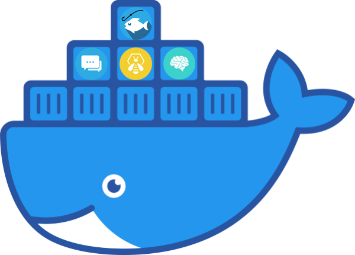

## Install ThePhish using Docker and Docker Compose



This folder contains the `docker-compose.yml` file needed to start ThePhish and all the required services with Docker Compose. It uses the following images:
- [cassandra:3.11](https://hub.docker.com/_/cassandra)
- [thehiveproject/thehive4:4.1.9-1](https://hub.docker.com/r/thehiveproject/thehive4)
- [docker&#46;elastic&#46;co/elasticsearch/elasticsearch:7.11.1](https://www.docker.elastic.co/r/elasticsearch/elasticsearch:7.11.1)
- [thehiveproject/cortex:3.1.1-1](https://hub.docker.com/r/thehiveproject/cortex)
- [redis:6.2.5](https://hub.docker.com/_/redis?tab=description)
- [mysql:8.0.26](https://hub.docker.com/_/mysql)
- [coolacid/misp-docker:core-v2.4.148a](https://hub.docker.com/r/coolacid/misp-docker)
- [emalderson/thephish:latest](https://hub.docker.com/r/emalderson/thephish)

These images are used with a minimal configuration. You can change the default parameters that are provided in the `docker-compose.yml` file. Moreover, it is possible to use additional settings by following the configuration guides available for those images.

This folder also contains three subfolders that contain the configuration files used by TheHive, Cortex and ThePhish and that will be mounted as volumes in the respective containers.

In order to use this installation method, it is required to have a Linux-based OS with Docker 19.03.0+ and Docker Compose 1.25.5+ installed. The guide to install Docker can be found [here](https://docs.docker.com/engine/install/), while the guide to install Docker Compose can be found [here](https://docs.docker.com/compose/install/).

This guide will not only show you how to run the containers but also how to configure them so that you'll be able to analyze your first email.

### Run the containers with Docker Compose

1. Clone the repository
    ```
    $ git clone https://github.com/emalderson/ThePhish.git
    ```

2. Run the multi-container application.

    ```
    $ cd ThePhish/docker
    $ docker-compose up
    ```
  

3. If the logs start showing many errors, this is because you need to change the ownership of some folders. Indeed, a new folder called `vol` will be created that will be used by the various containers to store data. You need to change the owner of some of its subfolders to match the user that has run the `docker-compose up` command so that the containers will be able to access their content.
In order to do that, you need to stop the application, apply the change of ownership and then restart the application.
    ```
    $ docker-compose stop
    $ sudo chown -R 1000:1000 vol/index vol/data vol/elastic*
    $ docker-compose up
    ```
	This must be done once all the files in those folders have been created. If you face the same errors after having followed this procedure, try waiting some time (minutes) and re-execute the command to change the ownership of those folders recursively.

### Configure the IMAP server

It is advisable that the email address from which ThePhish fetches the emails to analyze be a Gmail address since it is the one with which ThePhish has been tested the most. It is preferable that the account is a newly created one, with the sole purpose of being used by ThePhish. [Here](https://support.google.com/accounts/answer/185833?hl=en) is explained the procedure to activate the app password that is required by ThePhish to connect to the mailbox and fetch the emails.

Let's suppose that a Gmail address will be used. Once the email address is ready to use, edit the *imap* part of the file`thephish_conf_files/configuration.json` so that it looks like this:

```json
"imap" : {
	"host" : "imap.gmail.com",
	"port" : "993",
	"user" : "<YourEmailAddress>",
	"password" : "<YourEmailAddressAppPassword>",
	"folder" : "inbox"
}
```

### Configure the MISP container

1. Go to `https://localhost` and log in with the default credentials:
	- Username: `admin@admin.test`
	- Password: `admin`
2. Create a new organization
	1. Administration -> Add Organization
	2. Name: `<YourOrganizationName>`
	3. Click on "Generate UUID"
	4. Click on "Submit"
3. Change settings
	1. Administration -> Server Settings and Maintenance -> MISP Settings
	2. Change the field `MISP.live` to `True`
	3. Change the field `MISP.baseurl` to `https://localhost`
	4. Change the field `MISP.external_base_url` to `https://localhost`
	5. Change the field `MISP.org` to `<YourOrganizationName>`
	6. Change the field `MISP.host_org_id` to `<YourOrganizationName>`
4. Create a new user that is used for the integration with TheHive and Cortex
	1. Administration -> Add User
	2. email: `sync_user@<YourOrganizationDomain>`
	3. organization: `<YourOrganizationName>`
	4. role: `Sync User`
	5. Uncheck all the checkboxes
	6. click on "Create user"
5. Obtain the Authentication key of the `Sync User`
	1. Administration -> List Users
	2. Click on the "Eye" on the right for the just created user (View)
	3. Click on "Auth Keys"
	4. Delete the already created auth key
	5. Administration -> List Users (again)
	6. Click on the "Eye" on the right for the just created user (again)
	7. Click on "Auth Keys" (again)
	8. Click on "Add authentication key"
	9. Click on "Submit" and save it for later
6. Enable MISP feeds
	1. Sync Actions -> List Feeds -> Load default feed metadata -> All feeds
	2. Select the feeds to enable
	3. Click on "Enable selected"

### Configure the Cortex container

1. Go to `http://localhost:9001` and click on "Update database"
2. Create a new admin user
	1. Login: `admin@<YourOrganizationName>`
	2. Name: `admin`
	3. Password: `<Password>`
3. Create a new organization
	1. Organizations -> Add Organization
	2. Name: `<YourOrganizationName>`
	3. Description: `<YourOrganizationDescription>`
4. Create a new orgadmin user in that organization
	1. Click on the newly created organization `<YourOrganizationName>`
	2. Click on "Add user"
	3. Login: `thephish@<YourOrganizationName>`
	4. Full name: `ThePhish`
	5. Roles: `read, analyze, orgadmin`
	6. Click on "New password" for the newly created user and set a password for that user
5. Create another user in that organization that is used for the integration with TheHive and to use the API
	1. Click on the newly created organization `<YourOrganizationName>`
	2. Click on "Add user"
	3. Login: `integration_account@<YourOrganizationName>`
	4. Full name: `integration_account`
	5. Roles: `read, analyze`
	6. Click on "Create API key" and then on "Reveal" for the newly created user and save it for later
6. Log out the admin user and log in the orgadmin user (ThePhish)

### Enable the *Mailer* responder

On Cortex, while logged in with the orgadmin user, do the following:
1. Organization -> Responders
2. Enable the *Mailer* responder
3. Configure the *Mailer* responder
	1. from: `<YourGmailEmailAddress>`
	2. smtp_host :`smtp.gmail.com`
	3. smtp_port: `587`
	4. smtp_user: `<YourGmailEmailAddress>`
	5. smtp_pwd: `<YourGmailEmailAddressAppPassword>`

### Integrate Cortex with MISP

In order to run the Cortex neurons (analyzers and responders), it is possible to clone the repository containing the neurons and execute them locally in the Cortex container, but the recommended way is to use dockerized neurons (which is used in this case). This means that their images are pulled from Docker Hub once and then every time a neuron is executed, a container is created based on that image and is destroyed at the end of the execution. Those containers are started on the host system by the Docker client inside the Cortex container, which has access to the Docker daemon on the host system thanks to the UNIX socket *docker.sock* on which the Docker daemon is listening and that is mounted as a volume in the Cortex container.

Since the default bridge network created by Docker is the one to which the neuron containers are attached during their execution, the container that runs the *MISP_2_1* analyzer will not be able to reach the MISP instance in the MISP container unless that container is also connected to the default bridge network. Moreover, using the IP address of the interface that connects the MISP container to the default bridge network is the only way that the *MISP_2_1* analyzer container can use to reach the MISP instance since the embedded DNS server is not available in the default networks.

To connect the MISP container to the default bridge network execute the following commands:

```
$ docker network connect bridge misp
$ docker network inspect bridge
```

You should see the IP address that has been assigned in the default bridge network to the MISP container. It will be used to configure the *MISP_2_1* analyzer on Cortex.

Now, on Cortex, while logged in with the orgadmin user, do the following:
1. Organization -> Analyzers
2. Enable the *MISP_2_1* analyzer
3. Configure the *MISP_2_1* analyzer
	1. url: `https://<IPAddressOfTheMISPInstanceInTheDefaultBridgeNetwork>`
	2. key: `<AutheticationKeyOfTheSyncUserCreatedOnMISP>`
	3. cert_check: `False`
  
### Enable the analyzers

On Cortex, while logged in with the orgadmin user, do the following:
1. Organization -> Analyzers
2. Enable the desired analyzers and configure them (following [this](https://github.com/TheHive-Project/CortexDocs/blob/master/analyzer_requirements.md) guide)

**:warning: Warning**: The *Yara_2_0* analyzer does not work if you use this installation method (it will never find any match). In fact, it needs a folder that contains the Yara rules to use that should also be specified in the configuration of the analyzer in Cortex, but there is no way to make this folder visible to the analyzer. This is because, as already explained, the analyzers are executed as Docker containers and in this case the Yara container is automatically started without specifying any volume, making it impossible for the analyzer to access any Yara rule. 

### Integrate TheHive with Cortex

Edit the *cortex* part of the file `thehive/application.conf` to replace the `XXXXXXXXXXXXXXx` with the API key of the `integration_account` created in Cortex.

```
play.modules.enabled += org.thp.thehive.connector.cortex.CortexModule
cortex {
  servers = [
    {
      name = local
      url = "http://cortex:9001"
      auth {
        type = "bearer"
        key = "XXXXXXXXXXXXXXx"
      }
      # HTTP client configuration (SSL and proxy)
      #  wsConfig {}
     # List TheHive organisation which can use this Cortex server. All ("*") by default
     # includedTheHiveOrganisations = ["*"]
     # List TheHive organisation which cannot use this Cortex server. None by default
     # excludedTheHiveOrganisations = []
    }
  ]
  # Check job update time intervalcortex
  refreshDelay = 5 seconds
  # Maximum number of successive errors before give up
  maxRetryOnError = 3
  # Check remote Cortex status time interval
  statusCheckInterval = 1 minute
}
```

### Integrate TheHive with MISP

Edit the *misp* part of the file `thehive/application.conf` to replace the `XXXXXXXXXXXXXXx` with the Authentication key of the `sync_user` created in MISP.

```
# MISP configuration
play.modules.enabled += org.thp.thehive.connector.misp.MispModule
misp {
  interval: 5 min
  servers: [
    {
      name = "MISP THP"            # MISP name
      url = "https://misp/" # URL or MISP
      auth {
        type = key
        key = "XXXXXXXXXXXXXXx"             # MISP API key
      }
      wsConfig { ssl { loose { acceptAnyCertificate: true } } }
    }
  ]
}
```

### Configure the TheHive container

1. Go to `http://localhost:9000` and log in with the default credentials:
	- Username: `admin@thehive.local`
	- Password: `secret`
2. Create a new organization
	1. Click on "New organization"
	2. Name: `<YourOrganizationName>`
	3. Description: `<YourOrganizationDescription>`
3. Create a new orgadmin user in that organization
	1. Click on the newly created organization `<YourOrganizationName>`
	2. Click on "Create new user"
	3. Login: `thephish@<YourOrganizationName>`
	4. Full name: `ThePhish`
	5. Profile: `org-admin`
	6. Click on "New password" for the newly created user and set a password for that user
	7. Click on "Create API key" and then on "Reveal" for the newly created user and save it for later
4.  Log out the admin user and log in the orgadmin user (ThePhish)

### Configure the ThePhish container

Edit the *thehive* and the *cortex* parts of the file`thephish_conf_files/configuration.json` to set the API key of the `orgadmin` user created on TheHive and the API key of the `integration account` created on Cortex.

```json
{
	"thehive" : {
		"url" : "http://thehive:9000",
		"apikey" : ""
	},
	"cortex" : {
		"url" : "http://cortex:9001",
		"apikey" : "",
		"id" : "local"
	}
}
```

### Use ThePhish

First of all, you need to restart the multi-container application for the changes to be applied.

```
$ docker-compose stop
$ docker-compose up -d
```

Now the application should be reachable at `http://localhost:8080`.

**:warning: Warning**: If you are using Mozilla Firefox to use ThePhish and for some reason an error message appears during the analysis, it may be due to some settings in Firefox. This behavior has been observed after following this installation procedure on a virtual machine running Ubuntu 20.04.3 LTS and using Firefox. On the other hand, it has not been observed on any other browser on that system, nor on any browser (including Firefox) that was running on the Windows host and that was able to access ThePhish thanks to port forwarding.
_I recommend that you use another browser on Ubuntu if you face the same issue_, but if you want to use Firefox anyway, I found out that changing some settings in the Firefox configuration solves the problem. In order to change them, follow this procedure:
1. Open Firefox and type `about:config` in the address bar (accept the risk)
2. Find the `network.http.network-changed.timeout` setting and raise its value from 5 to an higher value (e.g. 60) [[stackoverflow]](https://stackoverflow.com/questions/35086868/when-firefox-38-sent-fin-ack-after-server-ack-an-http-get-from-firefox) 
3. Find the  `network.websocket.extensions.permessage-deflate` setting and change it to `false` [[stackoverflow]](https://stackoverflow.com/questions/35812600/why-do-i-receive-a-bad-scrambled-garbled-text-message-on-websocket)

This is because after some troubleshooting, it emerged that the Firefox browser closed the AJAX connection before receiving the response and also the messages sent on the WebSocket connection got corrupted.

### Additional configuration

You're all set now! When a user sends an email to the email address that you created, it will appear in the list of emails to analyze and you can select it for the analysis.
However, in order to make ThePhish work better, you should also configure the whitelist and the analyzer levels that best suit your needs by using the files `thephish_conf_files/analyzers_level_conf.json` and `thephish_conf_files/whitelist.json`. In order to learn how to do that, please refer to these two sections in the main installation guide: 
- [Analyzer levels](https://github.com/emalderson/ThePhish/blob/master/README.md#configure-the-analyzers)
- [Whitelist](https://github.com/emalderson/ThePhish/blob/master/README.md#use-the-whitelist)

**:warning:  WARNING: This procedure will install ThePhish and the required services with a minimal configuration that should not be used in production. If you want to use ThePhish in a production environment, please refer to the official installation guides of TheHive, Cortex and MISP, or to the documentation of the used images.**
